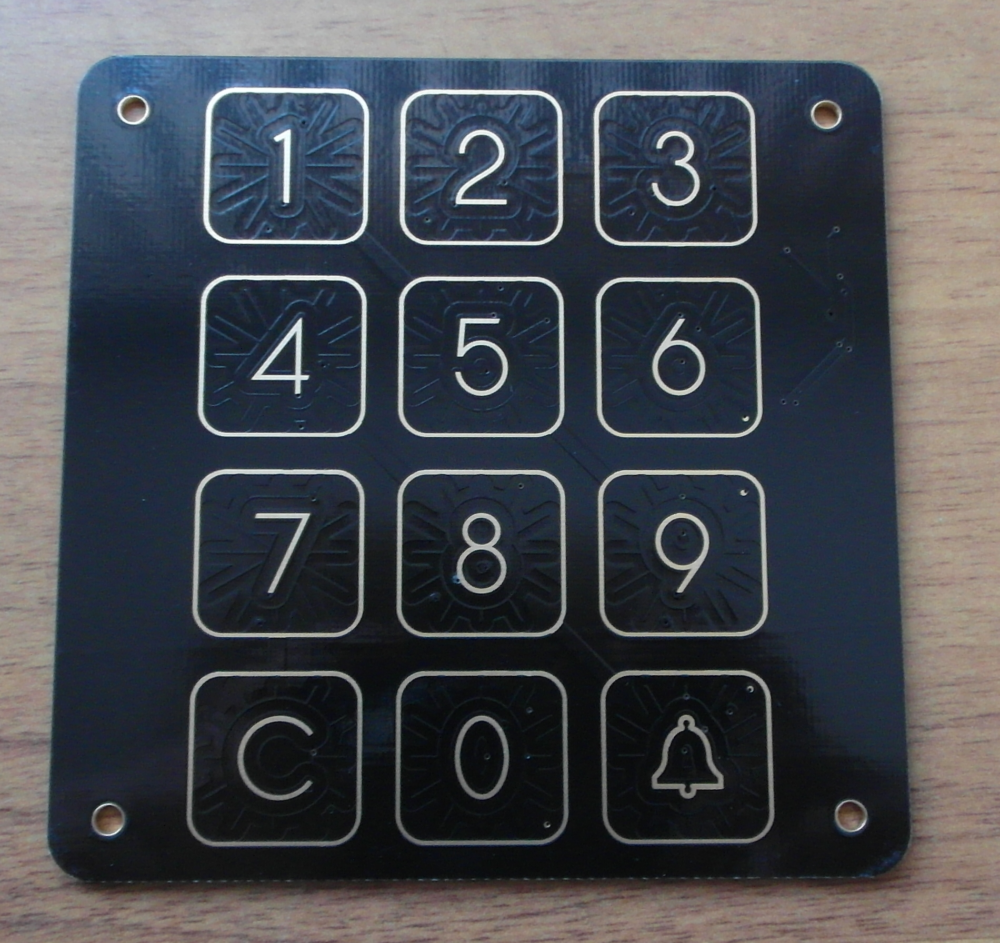

# Capacitive Touch Matrix Numpad For an Atmega328p 

## Files

- src/*        source code
- pcb/*        board & schematics

## Technical Background

- Excellent technical description by Viacheslav Slavinsky:

  http://sensi.org/~svo/capsensor/index.en.html

- QMatrix Whitepaper:

  http://ww1.microchip.com/downloads/en/DeviceDoc/qmatrix_white_paper_100.pdf

## PCB Design guidelines

- Moisture Tolerant QTouch Design:

  http://ww1.microchip.com/downloads/en/Appnotes/doc42017.pdf

- QTouch Schematic and Layout Checklist:

  http://ww1.microchip.com/downloads/en/Appnotes/Atmel-42094-QTouch-Schematic-and-Layout-Checklist_ApplicationNote_AT02259.pdf
